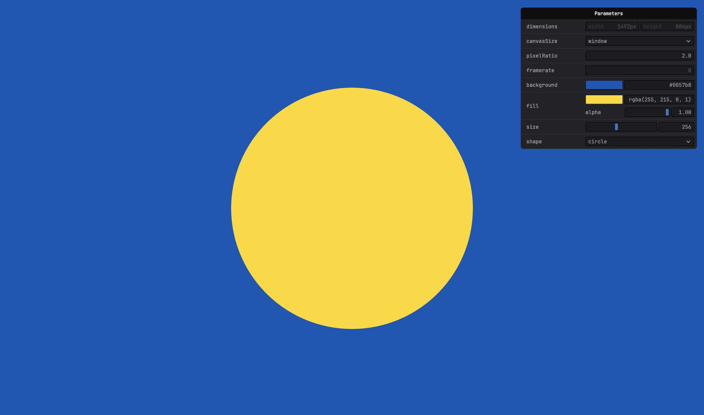

# Canvas2D - Shape

A 2D canvas sketch that draws a single centered shape—circle or square—with adjustable size, fill color, and background.

Based on [default template](../../docs/api/templates.md)

