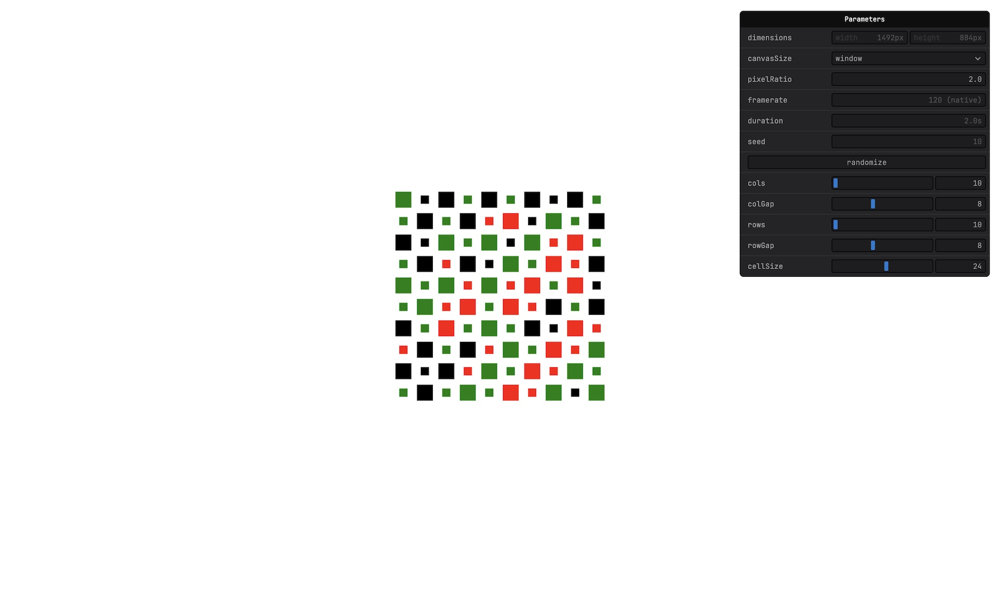

# p5.js - Grid

A [p5.js](https://p5js.org) sketch that builds a grid of squares whose colors and layout can be randomized with a single control. The cells animate in size, creating a shifting pattern across the grid.

