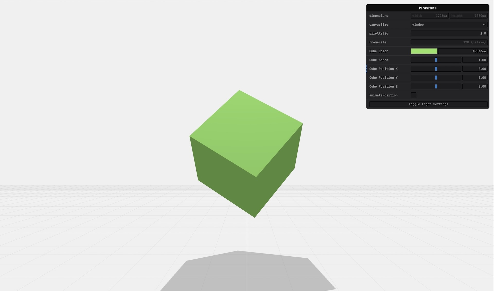

# three.js - WebGL Cube

A [three.js](https://threejs.org) scene with a rotating cube, adjustable color/position/speed, interactive camera controls, and optional spotlight debug helpers.

Based on [three.js perspective template](../../docs/api/templates.md)

